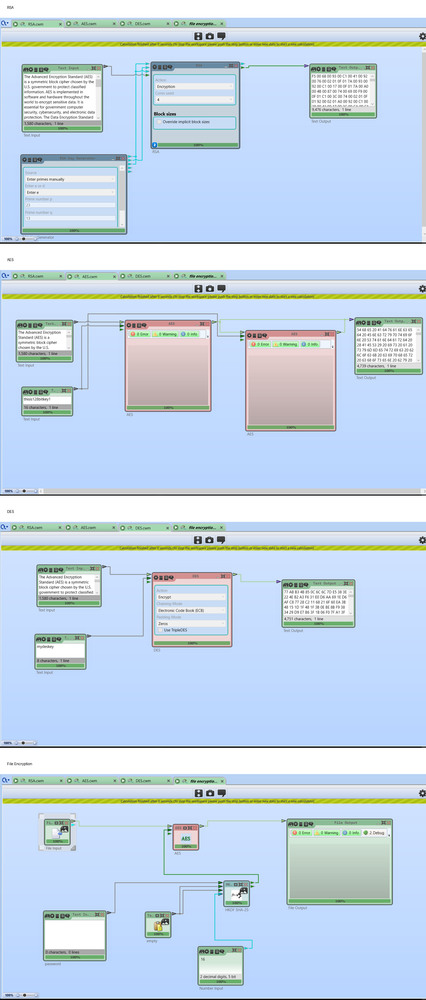

# Cryptography Algorithm Comparison

## Overview

This project explores and compares three widely used cryptographic algorithms: AES, DES, and RSA. The algorithms were studied and compared using **CrypTool 2**, along with a practical Arduino-based demonstration of cryptographic concepts.

## Algorithms Explored

* **AES (Advanced Encryption Standard)**
* **DES (Data Encryption Standard)**
* **RSA (Rivest–Shamir–Adleman)**

## Tools and Technologies

* CrypTool 2
* Arduino
* Arduino IDE

## Experiments

### AES, DES and RSA Comparison

AES, DES, and RSA were implemented and explored using CrypTool 2 to understand their encryption processes and compare their characteristics.

## Experiment Results

The following image shows the completed AES, DES, RSA, and file-encryption workflows in CrypTool 2.

### File Encryption

CrypTool 2 was also used to explore file encryption and understand how cryptographic techniques can be applied to protect data.

### Arduino Demonstration

An Arduino-based demonstration was developed to represent the different cryptographic algorithms using LED patterns. The Arduino receives the selected algorithm through serial input and produces a corresponding LED output.

## Learning Outcomes

This project provided practical exposure to both symmetric and asymmetric cryptography. It helped develop an understanding of how different encryption algorithms operate and how cryptographic techniques can be applied to protect information.

## Author

**Lakshaya Malviya**
